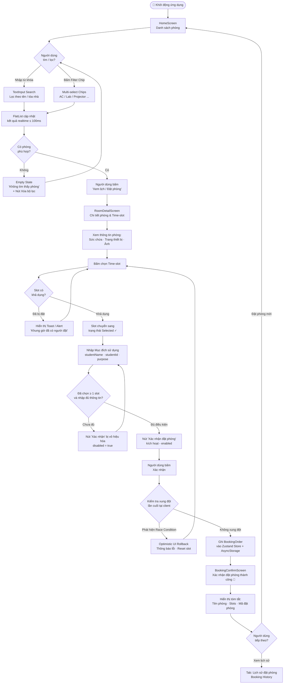
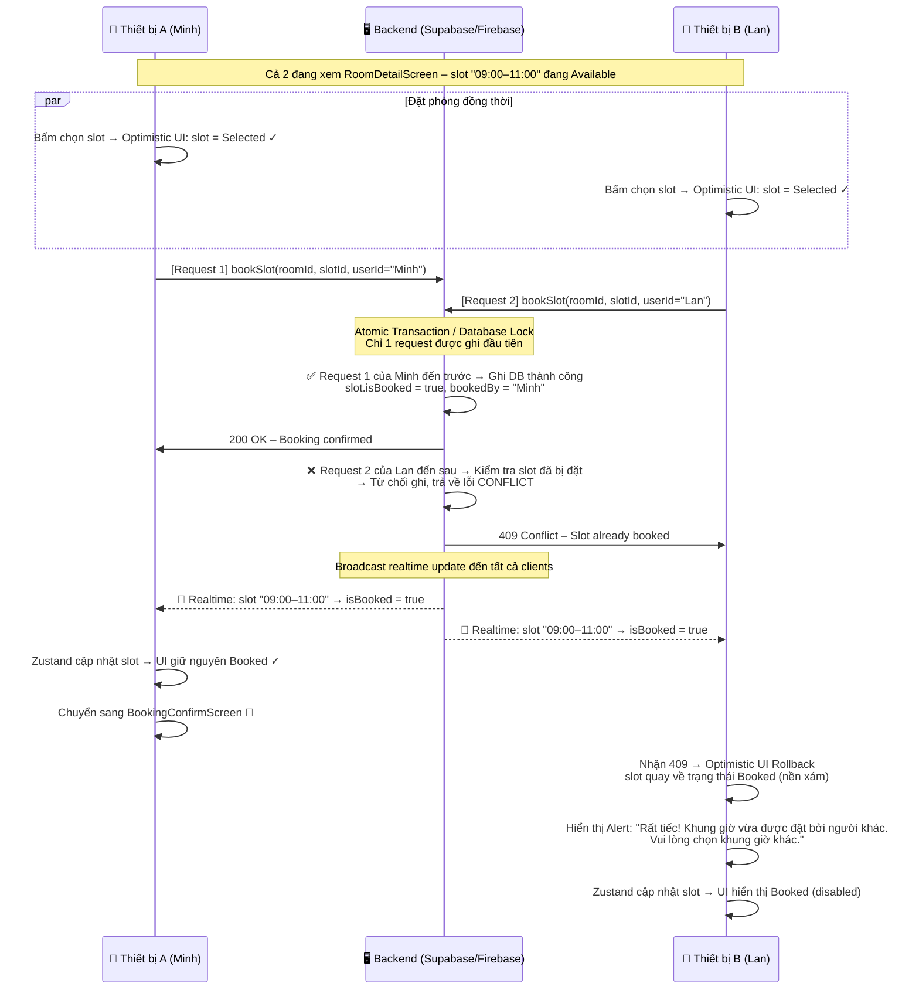
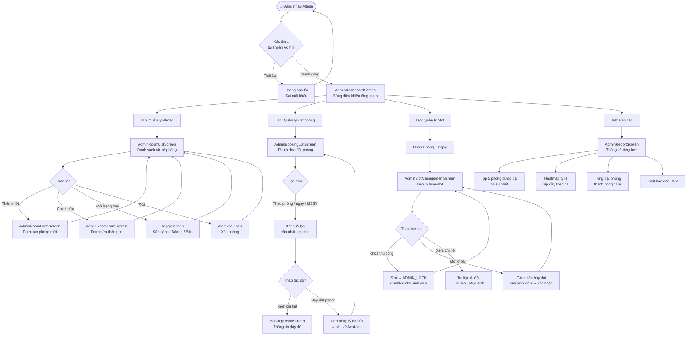

# Product Requirements Document (PRD)
## Mini-Project 2: Real-time Study Room Booking App (VKU Campus)

---

### Document Metadata
* **Project Name**: VKU Real-time Study Room Booking App
* **Author**: VKU Cross-Platform Mobile Engineering Team
* **Course**: Cross-Platform Mobile App Development (DA_NEN_TANG)
* **Status**: Approved / In Progress (Sprint Week 5 - Week 6)
* **Target Platforms**: iOS & Android (Expo / React Native)

---

### 1. Executive Summary

#### Problem Statement
Sinh viên và giảng viên tại campus VKU gặp khó khăn trong việc tìm kiếm phòng tự học và phòng máy tính (Lab) đang còn trống; việc tra cứu thủ công qua bảng thông báo hoặc nhóm chat thường dẫn đến tình trạng trùng lịch (double-booking), lãng phí thời gian di chuyển và không nắm rõ trang thiết bị thực tế của từng phòng.

#### Proposed Solution
Xây dựng ứng dụng di động đa nền tảng thời gian thực cho phép người dùng tra cứu nhanh, lọc linh hoạt theo trang thiết bị, xem trạng thái phòng với bảng danh sách hiệu năng cao (đạt 60 FPS) và đặt khung giờ (time-slot) với cơ chế phòng ngừa trùng lịch tức thì (instant conflict prevention).

#### Success Criteria (Measurable KPIs)
1. **Performance (Hiệu năng cuộn)**: Tốc độ khung hình danh sách phòng (`FlatList`) đạt trung bình **$\ge 58\text{ FPS}$** (chuẩn 60 FPS) trên các thiết bị di động tầm trung, không có hiện tượng lag/giật khung hình khi cuộn nhanh qua 100+ phòng.
2. **Search & Filter Latency**: Thời gian phản hồi từ lúc nhập ký tự tìm kiếm hoặc bấm đổi Filter Chip cho đến khi cập nhật lại UI đạt **$\le 100\text{ ms}$**.
3. **Booking Integrity**: Đạt **100% độ chính xác trong kiểm soát trùng lịch** (Zero Double-Booking) – không cho phép 2 lượt đặt phòng chọn cùng một khung giờ của cùng một phòng tại cùng thời điểm.
4. **App Startup Time**: Thời gian khởi động nguội (Cold boot) đạt **$\le 1.2\text{ giây}$** nhờ tối ưu hóa với Hermes Engine trên Expo.

---

### 2. User Experience & Functionality

#### 2.1. User Personas
* **Persona 1 - Sinh viên tự học/làm việc nhóm (Minh - SV Năm 4)**: Cần tìm gấp phòng tự học có điều hòa, nhiều ổ cắm điện và wifi mạnh cho nhóm 4 người trong khung giờ 13:00 - 15:00 chiều nay.
* **Persona 2 - Trợ giảng/Lớp trưởng (Lan - SV Năm 3)**: Cần đặt trước phòng máy tính Lab (ít nhất 40 máy PC cấu hình cao, có máy chiếu) để lớp thực hành bài kiểm tra.

#### 2.2. User Stories & Acceptance Criteria (AC)

##### Story 1: Khám phá phòng & Lọc đa tiêu chí (Fast Room Discovery & Multi-parameter Filters)
* **User Story**: *Là một sinh viên, tôi muốn tìm kiếm theo tên phòng và bấm các nhãn lọc điều kiện để nhanh chóng lọc ra phòng phù hợp với nhu cầu học tập.*
* **Acceptance Criteria**:
  - [x] Có thanh tìm kiếm (`TextInput`) hỗ trợ tìm kiếm không dấu/có dấu theo: Tên phòng (VD: "Lab 302", "Phòng Tự Học K.A"), Tòa nhà ("Khu A", "Khu V").
  - [x] Cung cấp hàng **Filter Chips** cuộn ngang hoặc dàn linh hoạt gồm các tiêu chí: `Tất cả`, `Có máy chiếu`, `Phòng Lab PC`, `Điều hòa`, `Ổ cắm điện`, `Đang trống`.
  - [x] Hỗ trợ chọn đồng thời nhiều chip (Multi-select) để kết hợp điều kiện lọc (Logic AND).
  - [x] Hiển thị trạng thái "Không tìm thấy phòng phù hợp" (Empty State) kèm nút "Xóa bộ lọc" nếu kết quả rỗng.

##### Story 2: Danh sách phòng mượt mà 60 FPS (High-performance FlatList Feed)
* **User Story**: *Là người dùng di động, tôi muốn lướt danh sách phòng mượt mà, trực quan để xem tổng quan thông tin phòng mà không bị đơ giật.*
* **Acceptance Criteria**:
  - [x] Sử dụng `<FlatList>` kết hợp `keyExtractor`, `initialNumToRender={8}`, `maxToRenderPerBatch={8}`, `windowSize={5}`.
  - [x] Mỗi Card phòng hiển thị:
    - Ảnh phòng chất lượng cao qua `<Image>` với kích thước cố định và bo góc (`borderRadius: 12`).
    - Tên phòng, Vị trí tầng/tòa nhà, Sức chứa (`<Text>` kèm icon).
    - Huy hiệu trạng thái: `Sẵn sàng` (Xanh lá), `Đang bận` (Đỏ), `Bảo trì` (Xám).
    - Các icon trang thiết bị đi kèm (Máy chiếu, PC, Điều hòa, Bảng trắng).
  - [x] Nút "Xem lịch / Đặt phòng" dạng `<Pressable>` có hiệu ứng phản hồi xúc giác/màu sắc (Active Opacity / Android Ripple).

##### Story 3: Bộ chọn khung giờ & Chống trùng lịch tức thì (Time-slot Selector with Instant Conflict Prevention)
* **User Story**: *Là người đặt phòng, tôi muốn bấm chọn các khung giờ trong ngày và được hệ thống ngăn chặn ngay nếu khung giờ đó đã có người khác đặt.*
* **Acceptance Criteria**:
  - [x] Chia khung giờ cố định trong ngày theo ca: `07:00 - 09:00`, `09:00 - 11:00`, `13:00 - 15:00`, `15:00 - 17:00`, `18:00 - 20:00`.
  - [x] Trạng thái của từng Time-slot:
    - **Available (Khả dụng)**: Nền trắng viền xanh, cho phép người dùng click để chọn.
    - **Selected (Đang chọn)**: Nền xanh đậm, chữ trắng, hiển thị dấu tích xác nhận.
    - **Booked / Conflict (Đã được đặt)**: Nền xám nhạt, chữ xám mờ gạch ngang, thuộc tính `disabled={true}`, không cho phép click.
  - [x] Kiểm tra xung đột tức thì tại client: Nếu người dùng cố gắng tương tác hoặc slot vừa bị đặt, hệ thống hiển thị thông báo tức thời (Toast/Alert) và vô hiệu hóa nút submit.
  - [x] Nút "Xác nhận đặt phòng" chỉ kích hoạt (`enabled`) khi người dùng đã chọn ít nhất 1 slot hợp lệ và nhập đầy đủ mục đích sử dụng.

#### 2.3. Non-Goals (Phạm vi KHÔNG xây dựng ở giai đoạn này)
* ❌ Chưa xây dựng cổng thanh toán trực tuyến (phòng mở miễn phí cho sinh viên VKU).
* ❌ Chưa tích hợp quét mã QR mở cửa phòng tự động (tính năng dự kiến cho v2.0).
* ❌ Chưa xây dựng hệ thống phân quyền Admin duyệt đơn phức tạp ở Sprint 1.

---

### 2.4. Application User Flow (Luồng Hoạt Động Ứng Dụng)

Phần này mô tả luồng điều hướng và tương tác dự kiến của người dùng xuyên suốt ứng dụng, từ lúc khởi động đến khi hoàn tất đặt phòng.

#### Sơ đồ luồng tổng quan



---

#### Mô tả chi tiết từng màn hình & bước

##### 🏠 Bước 1 – HomeScreen (Màn hình Trang chủ)

| Hành động | Kết quả hiển thị |
| :--- | :--- |
| Mở ứng dụng (Cold boot ≤ 1.2s) | `FlatList` hiển thị toàn bộ danh sách phòng (Mock Data 20+ phòng) với trạng thái `Sẵn sàng / Đang bận / Bảo trì`. |
| Nhập từ khóa vào `TextInput` | Danh sách lọc realtime theo tên phòng hoặc tòa nhà, phản hồi ≤ 100 ms. |
| Bấm một hoặc nhiều **Filter Chip** | Logic AND được áp dụng: chỉ hiển thị phòng thỏa mãn **tất cả** điều kiện đã chọn. |
| Kết quả tìm kiếm rỗng | Hiển thị **Empty State** với nút "Xóa bộ lọc" để reset toàn bộ điều kiện. |
| Bấm nút "Xem lịch / Đặt phòng" trên Card | Điều hướng sang **RoomDetailScreen** (Stack Navigator `push`). |

##### 📋 Bước 2 – RoomDetailScreen (Màn hình Chi tiết phòng & Đặt lịch)

| Hành động | Kết quả hiển thị |
| :--- | :--- |
| Vào màn hình | Hiển thị ảnh phòng, sức chứa, danh sách trang thiết bị và **bảng Time-slot** trong ngày. |
| Bấm ô Time-slot **Available** | Ô chuyển sang trạng thái **Selected** (nền xanh đậm, dấu ✓), nút Xác nhận sáng dần. |
| Bấm ô Time-slot **Booked** | Không có phản hồi bấm (`disabled={true}`); hiển thị Toast "Khung giờ đã có người đặt". |
| Nhập thông tin sinh viên & mục đích | Nút "Xác nhận đặt phòng" chỉ `enabled` khi ≥ 1 slot được chọn VÀ form nhập hợp lệ. |
| Bấm nút "Xác nhận đặt phòng" | Kiểm tra xung đột lần cuối tại client → nếu OK thì ghi `BookingOrder` và chuyển màn hình. |
| Phát hiện Race Condition | Rollback slot về trạng thái `Booked`, hiển thị Alert lỗi, yêu cầu chọn lại. |

##### ✅ Bước 3 – BookingConfirmScreen (Màn hình Xác nhận thành công)

| Thông tin hiển thị | Mô tả |
| :--- | :--- |
| Tên & vị trí phòng | Ví dụ: "Lab 302 – Khu V, Tầng 3" |
| Danh sách slots đã đặt | Ví dụ: "09:00 – 11:00, 13:00 – 15:00" |
| Mã đặt phòng (`BookingOrder.id`) | Dạng UUID, dùng để tra cứu/hủy sau. |
| Tên & MSSV sinh viên | Hiển thị để xác nhận đúng người đặt. |
| Nút hành động | **"Đặt phòng mới"** → về HomeScreen; **"Xem lịch sử"** → Tab Booking History. |

#### Điều hướng tổng thể (Navigation Architecture – Phase 2)

```
App Root
├── Bottom Tab Navigator
│   ├── Tab: Trang chủ       → Stack Navigator
│   │   ├── HomeScreen
│   │   ├── RoomDetailScreen
│   │   └── BookingConfirmScreen
│   └── Tab: Lịch sử đặt phòng → BookingHistoryScreen
```

> **Ghi chú Phase 1**: Ở Sprint hiện tại, điều hướng Stack được giả lập bằng state hoặc `React Navigation` cơ bản (chưa có Bottom Tab). Tab Navigator và Zustand Global State được tích hợp ở **Phase 2 (Week 6)**.

---

### 2.5. Race Condition Data Flow – Kịch bản 2 Tài Khoản Đặt Cùng Lúc

Phần này mô tả chi tiết **luồng dữ liệu** khi 2 người dùng đồng thời thao tác đặt **cùng 1 time-slot của cùng 1 phòng** tại cùng thời điểm, và cách hệ thống xử lý để đảm bảo **Zero Double-Booking**.

---

#### ⚠️ Phase 1 – Giới hạn: Mỗi thiết bị có Zustand Store độc lập

Ở Phase 1, ứng dụng **chưa có backend thật** — mỗi thiết bị chỉ có riêng `Zustand Store` + `AsyncStorage` cục bộ, **không chia sẻ dữ liệu** với nhau qua mạng.

```
┌─────────────────────┐        ┌─────────────────────┐
│   Thiết bị A (Minh) │        │   Thiết bị B (Lan)  │
│                     │        │                     │
│  Zustand Store A    │   ✗    │  Zustand Store B    │
│  (slot: available)  │◄──────►│  (slot: available)  │
│                     │ Không  │                     │
│  AsyncStorage A     │  sync  │  AsyncStorage B     │
└─────────────────────┘        └─────────────────────┘
         ↓                               ↓
   Đặt thành công              Cũng đặt thành công
   (trên máy A)                (trên máy B – conflict thật!)
```

> **Kết luận Phase 1**: Race Condition thật sự **không thể phát hiện** ở giai đoạn này vì không có nguồn dữ liệu chung. Cơ chế "Instant Conflict Prevention" hiện tại chỉ ngăn **cùng một thiết bị** bấm 2 lần vào cùng 1 slot.

---

#### ✅ Phase 2/3 – Luồng xử lý đầy đủ khi có Backend Realtime (Supabase / Firebase)

Khi tích hợp backend, hệ thống sử dụng kết hợp **Optimistic UI** + **Atomic Write** + **Realtime Listener** để xử lý race condition.

##### Sơ đồ tuần tự (Sequence Diagram)



---

##### Mô tả từng giai đoạn xử lý

| Giai đoạn | Thiết bị A (Thắng) | Thiết bị B (Thua) |
| :--- | :--- | :--- |
| **1. Người dùng bấm slot** | Slot chuyển sang `Selected` ngay (Optimistic UI) | Slot chuyển sang `Selected` ngay (Optimistic UI) |
| **2. Gửi request lên server** | `bookSlot(roomId, slotId, "Minh")` | `bookSlot(roomId, slotId, "Lan")` |
| **3. Server xử lý (Atomic)** | ✅ Request đến trước → Ghi DB, `isBooked = true` | ❌ Request đến sau → Slot đã bị khóa → Trả lỗi 409 |
| **4. Nhận phản hồi** | `200 OK` → Tiếp tục sang màn hình xác nhận | `409 Conflict` → Rollback UI, slot → `Booked (disabled)` |
| **5. Realtime broadcast** | Nhận update → Zustand đồng bộ (không thay đổi) | Nhận update → Zustand đồng bộ, slot = `isBooked: true` |
| **6. Kết quả cuối** | 🎉 Đặt phòng thành công | ⚠️ Alert lỗi, mời chọn slot khác |

---

##### Cơ chế kỹ thuật then chốt

```typescript
// Zustand Action – Optimistic UI + Rollback Pattern
bookSlot: async (roomId: string, slotId: string, userId: string) => {
  // Bước 1: Optimistic update – cập nhật UI ngay lập tức
  set((state) => ({
    rooms: state.rooms.map(room =>
      room.id === roomId
        ? {
            ...room,
            slots: room.slots.map(slot =>
              slot.id === slotId
                ? { ...slot, isBooked: true, bookedBy: userId }
                : slot
            )
          }
        : room
    )
  }));

  try {
    // Bước 2: Gửi lên backend (Atomic Write)
    await supabase.rpc('book_slot_atomic', { roomId, slotId, userId });
    // → Thành công: UI đã đúng, không cần làm gì thêm

  } catch (error) {
    if (error.code === 'CONFLICT') {
      // Bước 3: Rollback – Hoàn tác Optimistic Update
      set((state) => ({
        rooms: state.rooms.map(room =>
          room.id === roomId
            ? {
                ...room,
                slots: room.slots.map(slot =>
                  slot.id === slotId
                    ? { ...slot, isBooked: true, bookedBy: error.bookedBy }
                    : slot
                )
              }
            : room
        )
      }));
      Alert.alert('Rất tiếc!', 'Khung giờ vừa được đặt bởi người khác. Vui lòng chọn khung giờ khác.');
    }
  }
}
```

> **Lưu ý quan trọng**: Hàm `book_slot_atomic` phía Supabase phải dùng **Row-Level Lock** (`SELECT ... FOR UPDATE`) hoặc **Conditional Update** (`UPDATE ... WHERE isBooked = false`) để đảm bảo tính nguyên tử, tránh 2 transaction cùng đọc `isBooked = false` rồi cùng ghi thành công.

---

### 3. AI System Requirements (Optional / Future Scope)
* Hiện tại hệ thống tập trung vào kiến trúc Core Components & State Management. Chưa tích hợp LLM ở giai đoạn MVP.
* *(Dự kiến cho v2.0)*: Gợi ý phòng học thông minh (Smart Room Matcher) dựa trên số lượng thành viên và lịch học định kỳ của sinh viên.

---

### 4. Technical Specifications

#### 4.1. Architecture Overview
```
┌───────────────────────────────────────────────────────────┐
│                    React Native (Expo)                    │
│                                                           │
│  ┌──────────────────────┐        ┌─────────────────────┐  │
│  │     Presentation     │        │     State Layer     │  │
│  │   (Search, Filter,   │ ◄────► │   Zustand Store     │  │
│  │   FlatList, SlotUI)  │        │ (Rooms, Bookings)   │  │
│  └──────────────────────┘        └──────────┬──────────┘  │
│             ▲                               │             │
│             │                               ▼             │
│  ┌──────────┴───────────┐        ┌─────────────────────┐  │
│  │    Fabric Renderer   │        │     Persistence     │  │
│  │    & Yoga Layout     │        │  (AsyncStorage/MMKV)│  │
│  └──────────────────────┘        └─────────────────────┘  │
└───────────────────────────────────────────────────────────┘
```

#### 4.2. Core Component Mapping (VKU Curriculum standard)
* `Search & Filter`: `<TextInput>`, `<Pressable>`, `<ScrollView horizontal>`
* `Room Feed`: `<FlatList>`, `<View>`, `<Text>`, `<Image>` (tái sử dụng Cell để giữ 60 FPS)
* `Slot Selector`: `<View style={styles.grid}>`, `<Pressable disabled={isBooked}>`

#### 4.3. Data Model Schema (TypeScript)

```typescript
export interface Facility {
  id: string;
  name: string;
  icon: string;
}

export interface TimeSlot {
  id: string;
  startTime: string; // e.g. "07:00"
  endTime: string;   // e.g. "09:00"
  isBooked: boolean;
  bookedBy?: string; // Student ID or Name
}

export interface StudyRoom {
  id: string;
  name: string;
  building: string;  // e.g. "Khu A", "Khu V"
  floor: number;
  capacity: number;
  imageUrl: string;
  facilities: string[]; // ["projector", "pc", "ac", "whiteboard"]
  status: 'available' | 'full' | 'maintenance';
  slots: TimeSlot[];
}

export interface BookingOrder {
  id: string;
  roomId: string;
  roomName: string;
  slotIds: string[];
  studentName: string;
  studentId: string;
  purpose: string;
  createdAt: string;
}
```

#### 4.4. Security & Validation
* Client-side validation: Chặn mọi request đặt phòng có mốc thời gian trong quá khứ hoặc mốc thời gian có `isBooked === true`.
* Giới hạn tối đa 2 ca học / 1 sinh viên / 1 ngày để đảm bảo công bằng tài nguyên cho toàn trường.

---

### 5. Risks & Roadmap

#### 5.1. Phased Rollout Plan
* **Phase 1 (Week 5 - Hiện tại)**:
  * Hoàn thiện Core Components: Thanh tìm kiếm, Filter Chips đa tiêu chí.
  * Tối ưu `<FlatList>` đạt chuẩn 60 FPS với Mock Data 20+ phòng.
  * Thiết kế component chọn Time-slot và giải thuật Instant Conflict Prevention.
* **Phase 2 (Week 6 - Tuần tiếp theo theo Slide)**:
  * Tích hợp **React Navigation**: Stack Navigator (HomeScreen $\rightarrow$ RoomDetailScreen $\rightarrow$ BookingConfirmScreen) và Bottom Tab Navigator.
  * Tích hợp **Zustand**: Quản lý Global State lưu trữ danh sách phòng, giỏ đặt phòng và lịch sử đặt phòng xuyên suốt các màn hình.
* **Phase 3 (v2.0)**:
  * Kết nối Realtime Backend (Supabase / Firebase Firestore WebSockets).
  * Push Notification nhắc trước giờ học 15 phút.

#### 5.2. Technical Risks & Mitigation Strategies
| Rủi ro kỹ thuật | Mức độ | Biện pháp giảm thiểu |
| :--- | :--- | :--- |
| **Drop Frame khi cuộn FlatList** nhiều ảnh | Cao | Dùng `initialNumToRender={6}`, nén kích thước ảnh đại diện phòng, sử dụng `React.memo` cho `RoomCardItem`. |
| **Race Condition (2 sinh viên bấm cùng lúc)** | Trung bình | Tích hợp khóa lạc quan (Optimistic UI Locking) kết hợp rollback nếu slot vừa bị chiếm. |
| **Bàn phím che ô nhập liệu** | Thấp | Bọc giao diện bằng `<KeyboardAvoidingView>` và `Keyboard.dismiss()`. |

---

### 6. Database Platform – Supabase (PostgreSQL)

#### 6.1. Lý do lựa chọn Supabase

Dựa trên phân tích các yêu cầu kỹ thuật đặc thù của dự án, **Supabase (PostgreSQL)** được chọn làm nền tảng database chính thức cho Phase 3 của ứng dụng VKU Study Room Booking.

Bốn tiêu chí đánh giá cốt lõi:

* **Atomic Transaction (Giao dịch nguyên tử)**: Yêu cầu then chốt để chống Race Condition. Khi 2 sinh viên bấm đặt cùng 1 slot cùng lúc, hệ thống phải đảm bảo chỉ đúng 1 người thành công mà không cần logic phức tạp phía server.
* **Realtime Subscription**: Slot bị đặt bởi user A phải tự động cập nhật trạng thái Booked trên màn hình của user B mà không cần refresh thủ công.
* **SDK tương thích Expo / React Native**: Thư viện chính thức `@supabase/supabase-js` hỗ trợ đầy đủ cho môi trường Expo mà không cần cấu hình native phức tạp.
* **Free Tier học thuật**: Cấp miễn phí 500 MB database và 2 GB bandwidth mỗi tháng, đủ cho quy mô dự án môn học.

#### 6.2. So sánh với các nền tảng thay thế

| Tiêu chí | Supabase (Lựa chọn) | Firebase Firestore | Firebase RTDB |
| :--- | :--- | :--- | :--- |
| **Loại database** | PostgreSQL – Quan hệ (SQL) | NoSQL – Document | NoSQL – JSON Tree |
| **Atomic Transaction** | Tự nhiên theo chuẩn SQL, không cần thêm code | Cần dùng `runTransaction()` API, phức tạp hơn | Không hỗ trợ transaction thực sự |
| **Realtime** | Có – dựa trên PostgreSQL LISTEN/NOTIFY | Có – WebSocket listener | Có – Nhanh nhất trong 3 |
| **Cấu trúc schema** | Chặt chẽ, giống TypeScript Interface | Schemaless – dễ lỗi dữ liệu | Schemaless – dễ lỗi dữ liệu |
| **Phù hợp dự án** | ⭐⭐⭐⭐⭐ Tối ưu nhất | ⭐⭐⭐⭐ Tốt | ⭐⭐⭐ Trung bình |

**Lý do Supabase vượt trội**: Câu lệnh `UPDATE time_slots SET is_booked = true WHERE id = ? AND is_booked = false` là cơ chế chống Race Condition đơn giản và mạnh mẽ nhất. PostgreSQL đảm bảo 2 transaction chạy đồng thời chỉ có đúng 1 cái ghi thành công — đây là đặc tính bản chất của SQL mà NoSQL không có.

#### 6.3. Cấu trúc dữ liệu dự kiến (3 bảng chính)

Supabase sử dụng PostgreSQL nên cấu trúc bảng ánh xạ 1-1 với các TypeScript Interface đã định nghĩa trong mục 4.3:

* **Bảng `study_rooms`**: Tương đương `interface StudyRoom`. Lưu thông tin phòng: tên, tòa nhà, tầng, sức chứa, ảnh đại diện, mảng trang thiết bị (`facilities[]`), trạng thái.
* **Bảng `time_slots`**: Tương đương `interface TimeSlot`. Lưu khung giờ theo từng ngày, với cột `is_booked` (boolean) và `booked_by` (Student ID). Ràng buộc `UNIQUE(room_id, slot_date, start_time)` ngăn tạo trùng slot.
* **Bảng `booking_orders`**: Tương đương `interface BookingOrder`. Lưu lịch sử đặt phòng hoàn chỉnh, dùng cho màn hình Booking History.

#### 6.4. Cơ chế chống Race Condition qua Stored Procedure

Thay vì để React Native gọi `UPDATE` trực tiếp (có thể bị race condition ở tầng network), toàn bộ logic đặt phòng được đóng gói trong một **Stored Procedure** phía Supabase. Procedure này thực hiện kiểm tra và ghi atomically trong một transaction duy nhất:

1. Kiểm tra slot có `is_booked = false` hay không.
2. Nếu có → ghi `is_booked = true` + tạo `booking_order`.
3. Nếu không (slot đã bị người khác chiếm) → trả về lỗi `SLOT_ALREADY_BOOKED`.
4. React Native nhận lỗi → thực hiện Optimistic UI Rollback + hiển thị Alert.

#### 6.5. Lộ trình tích hợp theo Phase

* **Phase 1 & 2 (Hiện tại)**: Dùng Mock Data cục bộ trong Zustand Store + AsyncStorage. Chưa kết nối Supabase.
* **Phase 3 (v2.0)**: Thay thế Mock Data bằng Supabase client. Kích hoạt Realtime Subscription trong Zustand store khi app khởi động. Toàn bộ thao tác đặt phòng chuyển sang gọi Stored Procedure atomic qua `supabase.rpc()`.

---

### 7. Admin Panel – Đặc tả Quản trị Hệ thống

#### 7.1. Admin Persona

* **Persona 3 – Quản trị viên Cơ sở (Anh Tuấn – Nhân viên Phòng Quản lý Cơ sở VKU)**: Chịu trách nhiệm quản lý danh sách phòng học, duyệt/hủy lịch đặt phòng vi phạm, cập nhật trạng thái bảo trì, theo dõi tỷ lệ sử dụng phòng theo tuần/tháng và khóa tài khoản sinh viên vi phạm quy định.

#### 7.2. Admin User Stories & Acceptance Criteria

##### Admin Story 1: Quản lý danh sách phòng (Room Management)
* **User Story**: *Là Admin, tôi muốn thêm, chỉnh sửa và xóa thông tin phòng học để đảm bảo dữ liệu luôn phản ánh đúng thực tế cơ sở vật chất.*
* **Acceptance Criteria**:
  - [ ] Màn hình `AdminRoomListScreen` hiển thị toàn bộ danh sách phòng dạng bảng (`FlatList`) với cột: Tên phòng, Tòa nhà, Sức chứa, Trạng thái, Thao tác.
  - [ ] Nút **"Thêm phòng mới"** mở `AdminRoomFormScreen` với form nhập: Tên phòng, Tòa nhà, Tầng, Sức chứa, URL ảnh, Danh sách trang thiết bị (checkbox multi-select), Trạng thái ban đầu.
  - [ ] Admin có thể **chỉnh sửa** thông tin bất kỳ phòng nào bằng cách bấm icon ✏️ trên từng dòng → mở `AdminRoomFormScreen` ở chế độ Edit với dữ liệu được điền sẵn.
  - [ ] Admin có thể **đổi trạng thái** phòng (`Sẵn sàng` / `Bảo trì` / `Đang bận`) trực tiếp từ danh sách bằng nút Toggle nhanh mà không cần vào trang chi tiết.
  - [ ] Xóa phòng yêu cầu xác nhận Alert "Bạn có chắc chắn muốn xóa phòng này? Toàn bộ lịch đặt liên quan cũng sẽ bị hủy."

##### Admin Story 2: Quản lý lịch đặt phòng (Booking Management)
* **User Story**: *Là Admin, tôi muốn xem toàn bộ lịch đặt phòng của sinh viên, có thể lọc theo phòng/ngày/sinh viên và hủy các đặt phòng vi phạm quy định.*
* **Acceptance Criteria**:
  - [ ] Màn hình `AdminBookingListScreen` hiển thị tất cả `BookingOrder` dạng danh sách có phân trang (20 items/trang).
  - [ ] Bộ lọc nhanh theo: Tên phòng, Ngày đặt, MSSV sinh viên, Trạng thái (Còn hiệu lực / Đã hủy).
  - [ ] Mỗi dòng đặt phòng hiển thị: Tên phòng, Sinh viên, Khung giờ, Mục đích sử dụng, Thời gian tạo đơn.
  - [ ] Admin có thể **hủy đặt phòng** bất kỳ (với lý do) → slot tự động trở về trạng thái `Available` → sinh viên nhận thông báo hủy.
  - [ ] Admin có thể **xem chi tiết** từng đơn đặt để kiểm tra thông tin đầy đủ trước khi ra quyết định.

##### Admin Story 3: Quản lý Time-slot theo ngày (Daily Slot Management)
* **User Story**: *Là Admin, tôi muốn xem và điều chỉnh trạng thái từng khung giờ của từng phòng trong một ngày cụ thể, để xử lý các tình huống đột xuất (bảo trì, sự kiện đặc biệt).*
* **Acceptance Criteria**:
  - [ ] Màn hình `AdminSlotManagementScreen` cho phép Admin chọn Phòng + Ngày → hiển thị lưới 5 time-slot của ngày đó.
  - [ ] Admin có thể **khóa thủ công** bất kỳ slot nào (đặt `is_booked = true`, `booked_by = "ADMIN_LOCK"`) để ngăn sinh viên đặt — dùng cho trường hợp bảo trì khẩn cấp hoặc sự kiện đặc biệt.
  - [ ] Admin có thể **mở khóa** slot đang bị chiếm (kể cả đang có người đặt) — hiển thị cảnh báo "Hành động này sẽ hủy đặt phòng hiện tại của sinh viên X".
  - [ ] Hiển thị tooltip chi tiết khi giữ lâu (long-press) trên mỗi slot: Ai đặt, lúc nào, mục đích gì.

##### Admin Story 4: Xem báo cáo thống kê (Usage Analytics)
* **User Story**: *Là Admin, tôi muốn xem báo cáo tổng hợp về tỷ lệ lấp đầy phòng theo tuần/tháng để đưa ra quyết định phân bổ tài nguyên.*
* **Acceptance Criteria**:
  - [ ] Màn hình `AdminReportScreen` hiển thị:
    - Top 5 phòng được đặt nhiều nhất trong tháng (dạng bar chart đơn giản).
    - Tỷ lệ lấp đầy (%) theo từng ca trong ngày (heatmap theo giờ).
    - Tổng số lượt đặt phòng thành công / hủy trong kỳ được chọn.
  - [ ] Admin có thể xuất báo cáo dưới dạng text/CSV để báo cáo lên ban quản lý.

---

#### 7.3. Admin UI Flow (Luồng Tương tác Giao diện Admin)



---

#### 7.4. Mô tả chi tiết từng màn hình Admin

##### 🖥️ AdminDashboardScreen (Bảng điều khiển)

| Thành phần UI | Mô tả |
| :--- | :--- |
| **Header** | Hiển thị tên Admin đang đăng nhập + nút Đăng xuất |
| **Thẻ thống kê nhanh** | 4 card tóm tắt: Tổng phòng / Đang bận hôm nay / Đặt phòng trong ngày / Phòng đang bảo trì |
| **Bottom Tab Navigator** | 4 tab: Phòng học · Đặt phòng · Slot · Báo cáo |
| **Alert realtime** | Badge đỏ trên tab Đặt phòng khi có đơn mới cần xem xét |

##### 🏠 AdminRoomListScreen (Quản lý Phòng)

| Hành động Admin | Kết quả UI |
| :--- | :--- |
| Vào màn hình | `FlatList` hiển thị tất cả phòng với chip trạng thái màu sắc |
| Bấm **"+ Thêm phòng"** | Mở `AdminRoomFormScreen` trống để tạo phòng mới |
| Bấm icon ✏️ trên Card | Mở `AdminRoomFormScreen` với dữ liệu điền sẵn để chỉnh sửa |
| Bấm Toggle trạng thái | Đổi ngay trạng thái phòng, cập nhật màu chip không cần reload |
| Bấm icon 🗑️ trên Card | Hiển thị Alert xác nhận → Xóa phòng + cascade xóa slot liên quan |
| Tìm kiếm theo tên | Lọc danh sách realtime giống HomeScreen của user |

##### 📋 AdminBookingListScreen (Quản lý Đặt phòng)

| Hành động Admin | Kết quả UI |
| :--- | :--- |
| Vào màn hình | Danh sách tất cả `BookingOrder` sắp xếp theo thời gian mới nhất |
| Bấm Filter (phòng/ngày/MSSV) | Danh sách lọc tức thì |
| Bấm vào 1 đơn đặt | Mở `BookingDetailScreen` xem đầy đủ thông tin |
| Bấm **"Hủy đặt phòng"** | Alert yêu cầu nhập lý do → xác nhận → slot về `Available` → sinh viên nhận thông báo |
| Xem trạng thái | Chip màu: **Xanh lá** = Còn hiệu lực, **Đỏ** = Đã hủy |

##### ⏰ AdminSlotManagementScreen (Quản lý Time-slot)

| Hành động Admin | Kết quả UI |
| :--- | :--- |
| Chọn phòng + ngày | Hiển thị lưới 5 ô time-slot của ngày đó |
| Bấm **"Khóa"** trên slot Available | Slot chuyển sang màu cam "Khóa bởi Admin", sinh viên không đặt được |
| Bấm **"Mở khóa"** trên slot bị chiếm | Cảnh báo hủy đặt của sinh viên → xác nhận → slot về Available |
| Long-press trên slot | Popup tooltip: Người đặt, thời gian đặt, mục đích sử dụng |

##### 📊 AdminReportScreen (Báo cáo thống kê)

| Thành phần | Mô tả |
| :--- | :--- |
| **Bộ chọn kỳ báo cáo** | Dropdown chọn: Hôm nay / Tuần này / Tháng này / Tùy chỉnh |
| **Top 5 phòng** | Bar chart ngang hiển thị số lượt đặt của 5 phòng được dùng nhiều nhất |
| **Heatmap theo ca** | Bảng màu 5 ca × 7 ngày trong tuần — càng đậm = càng bận |
| **Tổng kết** | Tổng đặt thành công, tổng hủy, tỷ lệ lấp đầy trung bình toàn trường |
| **Nút Xuất báo cáo** | Export dạng CSV/text để Admin gửi báo cáo lên ban quản lý |

---

#### 7.5. Kiến trúc điều hướng Admin (Navigation Architecture)

```
App Root
├── Stack: Auth
│   ├── LoginScreen (chung cho User & Admin)
│   └── [Nếu role = ADMIN] → AdminApp
│
├── AdminApp
│   └── Bottom Tab Navigator (Admin)
│       ├── Tab 1: Phòng học
│       │   └── Stack Navigator
│       │       ├── AdminRoomListScreen
│       │       └── AdminRoomFormScreen (Thêm / Sửa)
│       ├── Tab 2: Đặt phòng
│       │   └── Stack Navigator
│       │       ├── AdminBookingListScreen
│       │       └── BookingDetailScreen
│       ├── Tab 3: Slot
│       │   └── AdminSlotManagementScreen
│       └── Tab 4: Báo cáo
│           └── AdminReportScreen
│
└── UserApp (như cũ)
    └── Bottom Tab Navigator (Student)
        ├── HomeScreen
        ├── RoomDetailScreen
        ├── BookingConfirmScreen
        └── BookingHistoryScreen
```

---

#### 7.6. Phân quyền Admin vs. Sinh viên

| Chức năng | Sinh viên | Admin |
| :--- | :---: | :---: |
| Xem danh sách phòng | ✅ | ✅ |
| Tìm kiếm & lọc phòng | ✅ | ✅ |
| Đặt time-slot | ✅ | ❌ (Admin không đặt phòng) |
| Hủy đơn của chính mình | ✅ | ✅ |
| Hủy đơn của người khác | ❌ | ✅ |
| Thêm / Sửa / Xóa phòng | ❌ | ✅ |
| Khóa / Mở khóa time-slot thủ công | ❌ | ✅ |
| Xem báo cáo thống kê | ❌ | ✅ |
| Đổi trạng thái phòng (Bảo trì) | ❌ | ✅ |
| Xuất báo cáo CSV | ❌ | ✅ |

> **Ghi chú triển khai**: Phân quyền Admin được kiểm soát tại tầng Supabase thông qua **Row Level Security (RLS)** kết hợp với cột `role` trong bảng `users`. Mọi thao tác ghi từ Admin đều yêu cầu JWT token có `role = 'admin'` — client không thể giả mạo quyền này.
